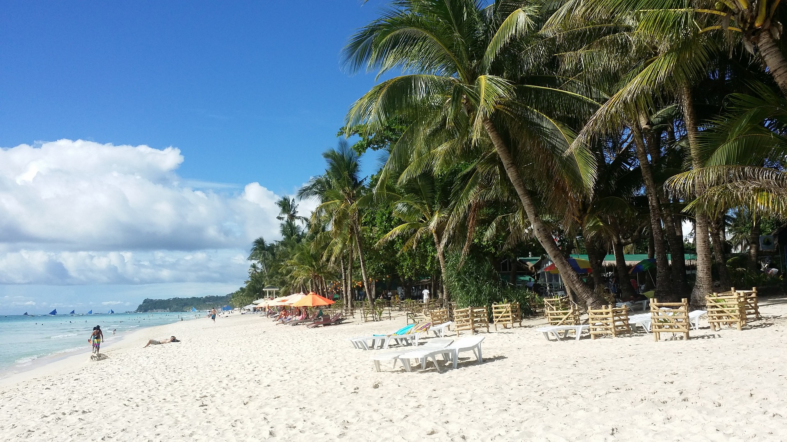
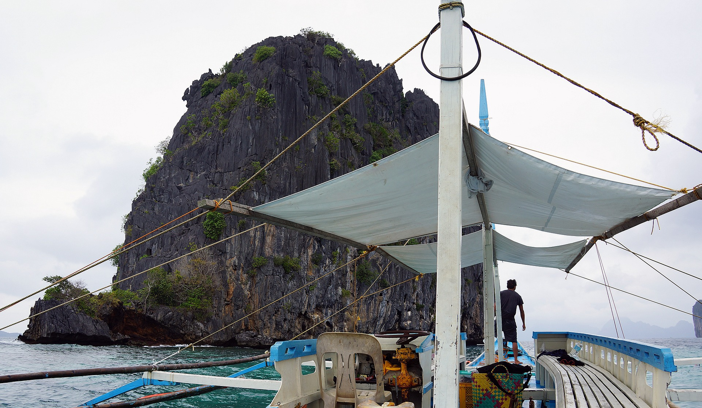
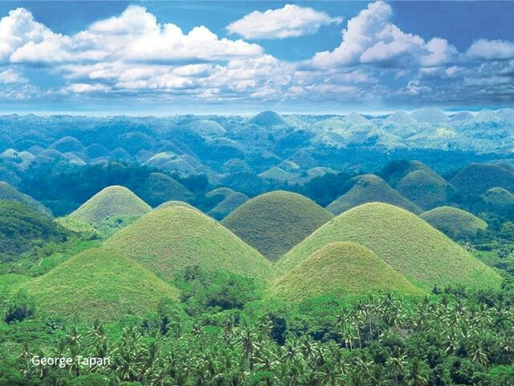
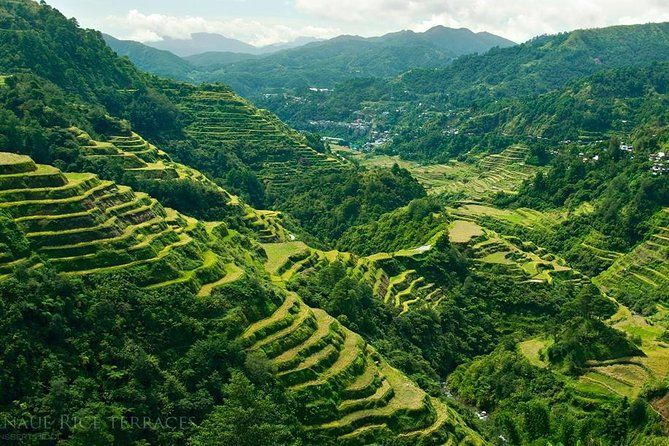
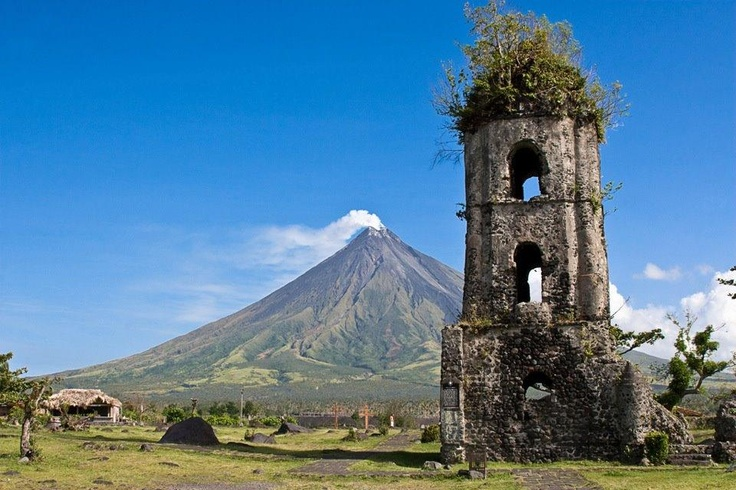

# Discover Philippines

Welcome to the Discover Philippines travel guide. Explore the most beautiful tourist spots in the Philippines.

## Top Destinations

### Boracay Beach

[^1]
Boracay is famous for its white sandy beaches and vibrant nightlife.

### El Nido, Palawan

[^2]
El Nido offers stunning limestone cliffs and crystal-clear waters.

### Chocolate Hills, Bohol

[^3]
Chocolate Hills is a unique geological formation with over 1,200 hills.

### Banaue Rice Terraces

[^4]
The Banaue Rice Terraces are an ancient marvel carved into the mountains.

### Mayon Volcano, Albay

[^5]
Mayon Volcano is known for its perfect cone shape and active status.

## Image Credits

[^1]: "Boracay Beach", [Source](https://pixabay.com/photos/boracay-beach-2065643/)
[^2]: "El Nido", [Source](https://pixabay.com/photos/el-nido-philippines-palawan-island-2654886/)
[^3]: "Chocolate Hills", [Source](https://ph.pinterest.com/pin/393220611216444154/)
[^4]: "Banaue Rice Terraces", [Source](https://ph.pinterest.com/pin/1150177192322887798/)
[^5]: "Mayon Volcano", [Source](https://ph.pinterest.com/pin/68820700525518102/)
